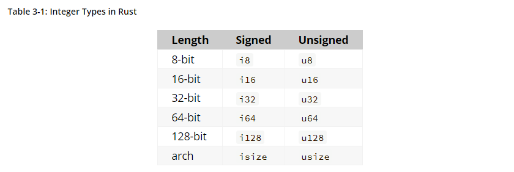
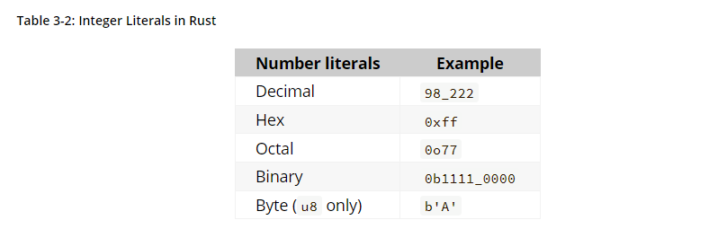

# Data Types 
러스트는 기본적으로 정적타입 언어이다. 즉, 컴파일 때 모든 변수들의 타입은 명시되어 있어야 한다. 

또한 러스트에는 데이터 타입이 Scala Type과 Compound Type 두가지로 나뉘어진다. 
### Scala Types 
scala type 은 단 하나의 값을 가진다. 

**Integer Types** 
integer type은 bit수 signed 혹은 unsigned 에 의해 다음 이미지와 같이 여러가지로 나뉘어진다. 

signed와 unsigned는 음수값을 포함하는 지 여부를 의미한다. 즉, 음수인지 양수인지를 나타내는 sign이 있는지 (signed) 혹은 그런 sign이 없는지 (unsinged) 에 따라 signed와 unsigned 로 나뉜다. 

추가적으로, isize와 usize는 프로그램이 돌아가는 컴퓨터의 아키텍쳐에 따라 달라지는 타입이다. 64-bit architecture이면 64bit가되고 32-bit architecture이면 32bit가 된다. 

또한 다음 그림과 같이 여러 진수를 사용해 integer 값을 표현할 수 있다. 

러스트의 default integer 타입은 i32이며, collection의 indexing으로 사용할 때에는 isize 혹은 usize를 사용하는 것을 추천한다. 러스트는 런타임에 integer overflow를 체크한다. 만약 integer overflow가 일어나면 panicking과 함께 프로그램이 종료되고 에러가 나타난다. 그러나 --release flag 와 함께 러스트가 실행되면 러스트는 integer overflow가 일어났을 때 러스트는 two's complement wrapping 이라는 것을 한다. 쉽게 말하면 u8 타입의 integer를 선언했을 때 256 을 넣으면 0이 되고 257을 넣으면 1이된다. 만약 integer overflow를 다른 방식으로 핸들링 하고 싶으면 기본 라이브러리를 통해 다음과 같은 방법들을 사용할 수 있다. 

- wrapping_* : wrapping_add와 같은 Wrap 메서드  
- checked_* : None값 리턴 하는 메서드  
- overflowing_* : 값과 함께 overflow가 일어났다는 것을 알리는 boolean 을 리턴하는 메서드 
- saturating_* : min 값과 max 값을 리턴하는 메서드