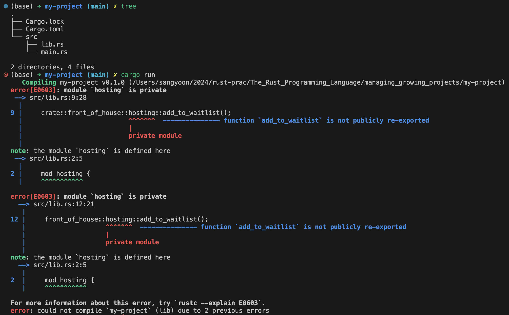

# Managing Growing Projects with Packages, Crates, and Modules 

점점 큰 프로젝트의 코드를 작성할 수록 관련있는 코드를 그룹핑하고 관련없는 코드들은 분리하는 등 코드를 정리하는 일은 점점 중요해진다. 이 장에서 우리는 코드를 정리하는 법을 배운다. 또한 코드의 수준을 한단계 높여줄 수 있는 캡슐화와 implementation에 대해서도 알아볼 것이다. scope (범위)는 이러한 기술들과 관련이 깊다.

Rust has a number of features that allow you to manage your code’s organization, including which details are exposed, which details are private, and what names are in each scope in your programs. These features, sometimes collectively referred to as the module system, include:

- Packages: A Cargo feature that lets you build, test, and share crates
- Crates: A tree of modules that produces a library or executable
- Modules and use: Let you control the organization, scope, and privacy of paths
- Paths: A way of naming an item, such as a struct, function, or module

먼저 **crate**은 Rust 컴파일러가 코드를 컴파일 할 때 고려하는 가장 작은 단위의 코드이다. 심지어 파일 하나를 rustc 명령어로 컴파일 할 때에도 Rust 컴파일러는 그 파일을 crate로 간주한다. Crate은 module들을 포함하고 있고, 어떤 module들은 다른 파일들에 정의되어 있을 수도 있다. 

crate은 binary crate과 library crate 두가지 중 한가지 형태로 형성된다. binary는 컴파일하고 실행할 수 있는 형태이고, library는 main 함수를 가지고 있지 않은, 또한 컴파일 할 수 없으며 실행할 수도 없는, 그러나 여러 다른 프로젝트들과 공유 할 수 있는 함수들이 정의되어 있는 crate이다. 

**package**는 하나 이상의 crate들의 모음이다. package는 그러한 여러 crate들을 어떻게 빌드 할 것인지가 작성되어 있는 Cargo.toml파일을 포함하고 있다. Cargo가 바로 그 package이다. package는 원하는 만큼 binary crate들을 포함할 수 있지만, 단 하나의 library crate만 포함할 수 있다. 그리고 package는 그것이 binary이든 혹은 library이든 반드시 하나 이상의 crate을 가지고 있어야 한다. 

In Rust, all items (functions, methods, structs, enums, modules, and constants) are private to parent modules by default. If you want to make an item like a function or struct private, you put it in a module.

Items in a parent module can’t use the private items inside child modules, but items in child modules can use the items in their ancestor modules. This is because child modules wrap and hide their implementation details, but the child modules can see the context in which they’re defined